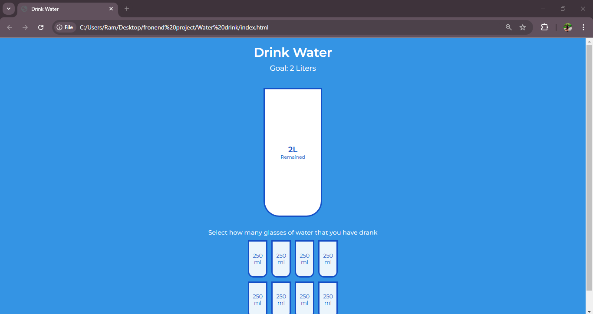

<h1>
  Water Tracker
</h1>
<h3>
  Summary 
</h3>

  This water drinking tracker, created using HTML, CSS, and JavaScript, helps users visualize and manage their daily hydration goals. The interface includes interactive water glasses or progress bars representing the total water intake for the day. Users can add or remove water consumption with a single click, dynamically updating the display to reflect progress toward the daily goal.

JavaScript handles the dynamic functionality, such as tracking water levels and updating the visuals in real-time. CSS provides responsive and appealing styling, often incorporating animations or transitions for a polished user experience.

This project can be further enhanced by integrating local storage to retain progress across sessions or adding notifications to remind users to drink water. It's an excellent project to demonstrate front-end development skills, including DOM manipulation, responsive design, and interactive UI creation.

